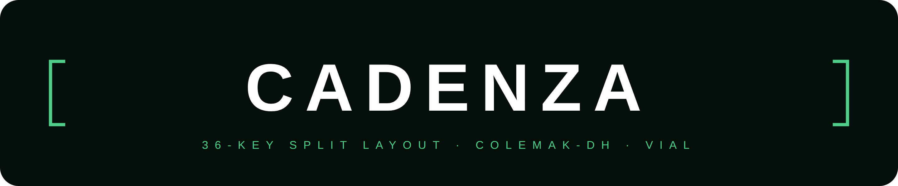

  
    
  

    
    
    
    
    
  

---

> *Cadenza (n.): a brilliant, technically demanding solo passage — calling for precision timing and controlled technique.*
 
**Cadenza** is a 36-key split keyboard layout for the [Corne Choc](https://github.com/foostan/crkbd), built on [Colemak-DH](https://colemakmods.github.io/mod-dh/) and configured entirely in [Vial](https://get.vial.today/). Tap Dance throughout — for Home Row Mods, bracket pairs, and layer access — keeping every key within reach of the home position.
Is is heavily inspired/based on the [Miryoku](https://github.com/manna-harbour/miryoku) layout.

## ✦ Highlights

- **Home Row Mods via Tap Dance** — per-key tipping terms (250 ms outer · 200 ms inner fingers)
- **11 layers** — alpha, mods/media, navigation, mouse, symbols, numbers, function keys, clipboard, brackets, code/CLI, international characters
- **Symmetric layer access** — L7/L8/L9/L10 reachable from either hand independently
- **Unified numpad grid** — L4, L5, L6 share the same physical layout shape
- **Code & CLI layer (L9)** — mirrored on both hands: ` | ` · `~/`/`../` · ` 2>&1 ` · `$()`/`${}`
- **International layer (L10)** — `\` · `|` · `` ` `` · `"` — dead-key workarounds for US International, both hands
- **Vial-native** — all layers, macros, and tap dance fully editable in Vial without any firmware rebuild

## ✦ Layer Overview

See **[docs/Cadenza-Layout.html](https://one7two99.github.io/cadenza)** for all layer screenshots.

| # | Layer | Activation | Purpose |
|---|---|---|---|
| L0 | Base | — | Colemak-DH + Home Row Mods |
| L1 | Mods & Media | Hold ESC | Modifiers · RGB · Media |
| L2 | Navigation | Hold Space | Cursor · Clipboard · Selection |
| L3 | Mouse | Hold Tab | Pointer · Scroll · Buttons |
| L4 | Shift Symbols | Hold Enter | Shifted symbol row (numpad layout) |
| L5 | Numbers | Hold Backspace | Numbers + operators (numpad layout) |
| L6 | Function Keys | Hold Delete | F1–F12 (numpad layout) |
| L7 | Clipboard | Hold Z *or* Hold `/` | System clipboard — both hands · left half has two clipboard rows |
| L8 | Bracket Pairs | Hold D *or* Hold H | Bracket tap/hold pairs — mirrored, same finger = same bracket both hands |
| L9 | Code & CLI | Hold C *or* Hold `,` | Shell & code sequences — both hands (mirrored) |
| L10 | International | Hold X *or* Hold `.` | `\` · `\|` · `` ` `` · `"` — both hands (mirrored) |

## ✦ What changed in v0.8.1

**L2 Navigation — `"` removed from inner home row.**
The double-quote shortcut on the N-key position (right inner home) has been removed.
German Umlaut input is now handled exclusively by the International layer (L10),
making L2 cleaner and avoiding the redundancy.

**L3 Mouse — `TD(4)` removed from inner home row.**
The backtick/code-fence tap dance is now available on L10 (middle finger), making
the L3 placement redundant. Inner home row on the mouse layer is now empty.

What changed in v0.8.0

**Layer 10 — International Characters:** dead-key and hard-to-reach characters
(`\` · `|` · `` ` `` · `"`) on a dedicated layer, mirrored on both hands.
Access: Hold X (left ring bottom) or Hold . (right ring bottom).
Completes the symmetric bottom-row layer access: Z//(L7) · X/.(L10) · C/,(L9) · D/H(L8).

**L9 mirrored:** Code & CLI sequences now available from either hand. Previously
right-hand only; the same finger on either hand now reaches the same sequence.

**L1 Media simplified:** Play / Mute / Stop removed from the bottom row —
they were already on the right thumb cluster. Duplication eliminated.

## ✦ Design Decisions

**Vial-native constraint:** Cadenza stays within Vial's 16 macro slots. Increasing this requires a custom firmware build, which breaks portability — the `.vil` file would only restore correctly on keyboards running that exact custom build. Staying within 16 means load, edit, and restore always works with the standard Vial app. This constraint shaped L9: only genuinely complex multi-character sequences earn a macro slot.

**Middle finger vs index finger for L9 access:** Holding C or , (middle finger down one row) was preferred over G or M (index finger laterally to inner column). The index finger anchors hand position; moving it sideways destabilizes the hand. The middle finger's natural motion is vertical — the same movement used to type C or , in normal typing.

## ✦ Installation

1. Flash standard [Vial firmware](https://get.vial.today/) on your Corne Choc
2. Open Vial desktop app, connect keyboard via USB
3. **File → Load saved layout** → select `firmware/Cadenza-Corne-Pro_v0_8_1.vil` attached to this release
4. OS keyboard layout must be set to **US International**

## ✦ Documentation

- **[docs/Cadenza-Layout.html](https://one7two99.github.io/cadenza)** — full documentation with layer visualisations, open in any browser
- **Layer screenshots** in `docs/layers/`

## ✦ Versioning

Cadenza follows [Semantic Versioning](https://semver.org/) — `vMAJOR.MINOR.PATCH`.

| Increment | When |
|---|---|
| **PATCH** | Bug fix — no key moves, no new features |
| **MINOR** | New layer, macro, or Tap Dance added |
| **MAJOR** | Existing key behaviour changes — muscle memory impact |

The project is currently in `v0.x.x` — initial development, no stability
guarantees. `v1.0.0` will be tagged when the core layout is complete and
validated.

Full versioning policy: [docs/VERSIONING.md](docs/VERSIONING.md)

## ✦ Contributing

See [CONTRIBUTING.md](CONTRIBUTING.md). Ports, language variants, and usage reports are especially welcome.

## ✦ License

Designed by **one7two99** · [MIT](LICENSE) · 2026

> *Based on [Colemak-DH](https://colemakmods.github.io/mod-dh/) by stevep99 · Inspired by [Miryoku](https://github.com/manna-harbour/miryoku)*
